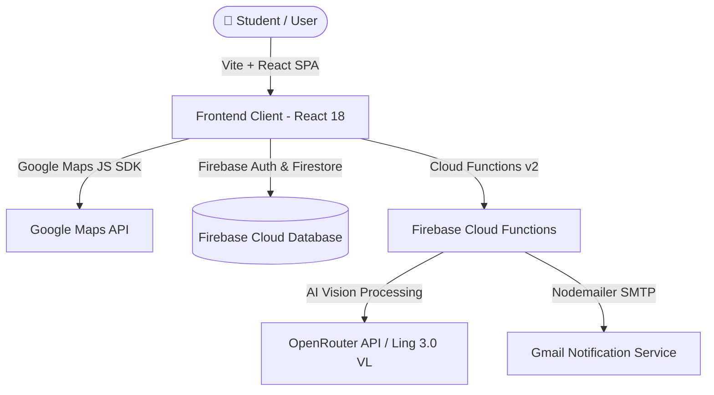

<div align="center">

  

  # 🎓 Campus Nav & Student Dashboard

  **The Smartest Way to Navigate Campus, Track Attendance & Manage Timetables**

  [](https://reactjs.org/)
  [](https://vitejs.dev/)
  [](https://firebase.google.com/)
  [](https://openrouter.ai/)
  [](https://developers.google.com/maps)
  [](LICENSE)

  [Live Demo](https://college-dashboard-cd.web.app) • [Report Bug](https://github.com/Divyesh1510/College-Dashboard/issues) • [Request Feature](https://github.com/Divyesh1510/College-Dashboard/issues)

</div>

---

## 📌 Overview

**Campus Nav** is a modern, full-stack university navigation and academic companion web app built for students and university staff. It features real-time indoor/outdoor campus map routing, intelligent attendance target calculations, automated **AI-powered screenshot parsing** for timetable and attendance imports, and an admin room approval suite.

---

## ✨ Key Features

<table>
  <tr>
    <td width="50%">
      <h3>🗺️ Smart Campus Navigation</h3>
      <ul>
        <li>Interactive Google Maps integrating custom campus nodes & room routing.</li>
        <li>Filter by building, block, canteen, auditorium, or specific classroom.</li>
        <li>Live GPS tracking and walking routes across campus.</li>
      </ul>
    </td>
    <td width="50%">
      <h3>📊 Visual Attendance Tracker</h3>
      <ul>
        <li>Dynamic percentage progress bars and color-coded safety indicators.</li>
        <li>Automatic low-attendance alerts for subjects below the <b>75% target</b>.</li>
        <li>Bunk calculator telling you how many classes you can skip/attend.</li>
      </ul>
    </td>
  </tr>
  <tr>
    <td width="50%">
      <h3>🤖 AI Screenshot Parser</h3>
      <ul>
        <li>Upload attendance or timetable screenshots directly from your phone.</li>
        <li>Powered by <b>AI Vision (OpenRouter / Ling 3.0 VL)</b> to auto-populate classes.</li>
        <li>Zero manual data entry required.</li>
      </ul>
    </td>
    <td width="50%">
      <h3>📅 Interactive Timetable Manager</h3>
      <ul>
        <li>Weekly schedule grid mapping days, time slots, faculty, and room codes.</li>
        <li>Integrated view of today's upcoming classes directly on the home dashboard.</li>
        <li>Quick room lookup links right from your schedule.</li>
      </ul>
    </td>
  </tr>
</table>

---

## 🛠️ Tech Stack & Architecture



- **Frontend**: React 18, Vite, Lucide Icons, Glassmorphism CSS Design System.
- **Backend / Serverless**: Firebase Cloud Functions (Node.js 20).
- **Database & Auth**: Firebase Firestore, Firebase Authentication (Google OAuth & Native Tokens).
- **AI & Computer Vision**: OpenRouter API (`inclusionai/ling-3.0-flash-vl:free` / Gemini Vision).
- **Mapping & Geospatial**: `@vis.gl/react-google-maps`, Google Directions Service.

---

## 🚀 Getting Started

Follow these steps to get a local copy up and running on your machine.

### 📋 Prerequisites

- **Node.js**: `v18.0.0` or higher
- **npm**: `v9.0.0` or higher
- **Firebase CLI**: `npm install -g firebase-tools`

---

### ⚙️ Installation & Configuration

1. **Clone the repository**:
   ```bash
   git clone https://github.com/Divyesh1510/College-Dashboard.git
   cd Campus-Nav-Gitam
   ```

2. **Install dependencies**:
   ```bash
   # Install frontend dependencies
   npm install

   # Install Cloud Functions dependencies
   cd functions
   npm install
   cd ..
   ```

3. **Set up Environment Variables**:

   Create a `.env` file in the **root directory** (refer to [`.env.example`](file:///.env.example)):
   ```env
   VITE_GOOGLE_MAPS_API_KEY=your_google_maps_api_key
   VITE_FIREBASE_API_KEY=your_firebase_api_key
   VITE_FIREBASE_AUTH_DOMAIN=campus-nav-gitam.firebaseapp.com
   VITE_FIREBASE_PROJECT_ID=campus-nav-gitam
   VITE_FIREBASE_STORAGE_BUCKET=campus-nav-gitam.firebasestorage.app
   VITE_FIREBASE_MESSAGING_SENDER_ID=your_messaging_sender_id
   VITE_FIREBASE_APP_ID=your_firebase_app_id
   VITE_GOOGLE_CLIENT_ID=your_google_client_id.apps.googleusercontent.com
   OPENROUTER_API_KEY=your_openrouter_api_key
   ```

   Create a `.env` file in the **`functions/` directory** (refer to [`functions/.env.example`](file:///functions/.env.example)):
   ```env
   GMAIL_EMAIL="your_email@gmail.com"
   GMAIL_PASSWORD="your_gmail_app_password"
   OPENROUTER_API_KEY="sk-or-v1-your_openrouter_api_key_here"
   ```

---

## 🔑 Where to Get Required API Keys

| Provider | Where to Obtain | Usage |
| :--- | :--- | :--- |
| **Google Maps** | [Google Cloud Console](https://console.cloud.google.com/) | Enable *Maps JavaScript API* & *Directions API* |
| **Firebase** | [Firebase Console](https://console.firebase.google.com/) | Register a Web App under Project Settings |
| **OpenRouter AI** | [OpenRouter Keys](https://openrouter.ai/keys) | Free API Key for AI Screenshot Vision OCR |
| **Gmail App Pass** | [Google Security Passwords](https://myaccount.google.com/apppasswords) | 16-character SMTP password for notifications |

---

## 💻 Running Locally

Start the local Vite development server:
```bash
npm run dev
```
Visit **`http://localhost:5173`** in your browser.

---

## 📦 Deployment Guide

### Deploy Frontend to Firebase Hosting
```bash
npm run build
firebase deploy --only hosting
```

### Deploy Backend Functions to Firebase
```bash
firebase deploy --only functions
```

---

## 🤝 Contributing

Contributions are what make the open-source community an amazing place to learn, inspire, and create!

1. Fork the Project
2. Create your Feature Branch (`git checkout -b feature/AmazingFeature`)
3. Commit your Changes (`git commit -m 'Add some AmazingFeature'`)
4. Push to the Branch (`git push origin feature/AmazingFeature`)
5. Open a Pull Request

---

## 📝 License

Distributed under the MIT License. See [`LICENSE`](LICENSE) for more information.

---

<div align="center">
  <sub>Built with ❤️ by Divyesh Reddy & the Campus Nav Team</sub>
</div>
